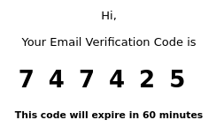

# 🧺 Frontload

Angular based Web App to be used as a template or starting off point for frontend projects.

    

***This is designed to work with [Backdraft](https://github.com/ImranR98/Backdraft); see that project for more details.***

## Features
- Frontend to all Backdraft endpoints/features.
- Bootstrap UI.
- Dark mode (automatic; follows system).
- Internationalization.

## Setup/Usage
1. Use `npm i` to install required dependencies.
2. Build the project for production or run it in a development environment using the scripts defined in `package.json`.

## Project Structure

### Components and Pages
The `components` directory contains all Angular components, except the page components (accessed via routes).

The `pages` directory contains all page components.

### Models and Services
The `services` directory contains all Angular services, such as those used to make API requests. These should be broken into spearate services based on their function.

The `models` directory contains any TypeScript models (and in some cases, custom classes) used in the app. 

### Everything Else
The remaining files in `/src` include:
- The `app-http.interceptor.ts` contains the HTTP interceptor used to insert the JWT token (if any) into each request, and to intercept 401 errors when the token needs to be refreshed.
- The `locale` directory contains language translation files for internationalization. For more info on this, read the official [Angular internationalization docs](https://angular.io/guide/i18n-overview).

## Typical Flow for Implementing New Features

Implementing new functionality in the application usually involves:
- Checking the API spec for relevant endpoints and models.
- Creating a service (or adding to an existing one) with functions to make the relevant requests (along with any related state management).
- Creating or modifying the relevant components and pages to make use of the new functions.
- Adding new routes if needed.

## Notes
1. Note that the boilerplate code files for unit tests exist (`.spec.ts` files) as they are automatically generated by Angular. However, automated testing has not been implemented.
2. Form validation in this project is repetitive, because the validation on Angular's reactive forms is not picked up by Bootstrap. Therefore, the validation needs to be done once in the component class, and a second time on the template HTML; the latter doesn't actually validate anything, but is required to ensure validation errors are shown.

## Screenshots

Welcome Page - Authentication

Internationalization (Swahili example)

Account Page

Form Validation on Change Password Page

Login Revocation

Email Verification Code for Signup or Password Reset

Dark Mode

Responsive UI (Mobile View)

